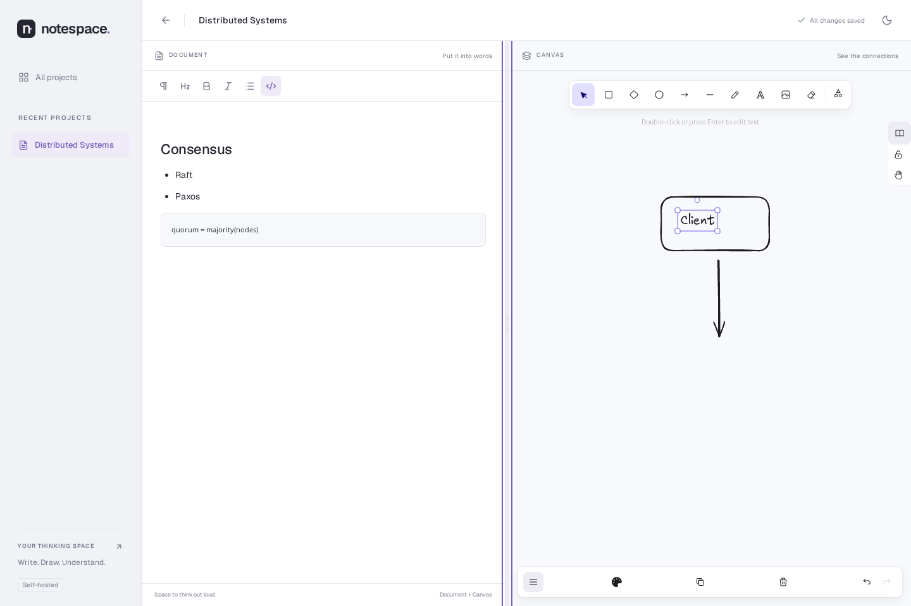

# Notespace

A free, self-hosted workspace for writing and spatial thinking. Each **Project** owns one structured document and one Excalidraw canvas, with a shared title, lifecycle, and save status.

Sprint 1 includes create/open/delete, recent projects, title search, structured notes, a resizable canvas workspace, light/dark themes, and SQLite persistence.



## Self-host with Docker

```sh
git clone https://github.com/howlil/notespace.git
cd notespace
docker compose up --build -d --wait
```

Open **http://localhost:8080**. `.env.example` documents optional port/bind and data-volume settings; the defaults need no configuration. Compose runs one Go process serving the built web app and API, with SQLite in the explicitly named `notespace-data` volume. The explicit volume name keeps data attached to the installation even when a deployment tool changes the Compose project name. No Node process or external database is needed at runtime.

This first slice is a private, single-instance tool with **no authentication**. The host port binds to loopback. Use a trusted private network or an authenticating reverse proxy if exposing it beyond your machine. Do not use `docker compose down -v` unless you intend to remove all project data. For a simple consistent backup, stop the container and copy the entire volume, including any SQLite WAL files, before starting it again. Redeploy with the same `NOTESPACE_DATA_VOLUME` value; `docker compose down` without `-v` preserves the data volume.

## Development

Requires Node.js 24, pnpm 11.19.0, Go 1.25+ and Task 3.x. Windows PowerShell is supported by these commands.

```sh
npm install --global pnpm@11.19.0
go install github.com/go-task/task/v3/cmd/task@latest
pnpm install --frozen-lockfile
```

Run the complete development stack from the repository root:

```sh
task dev
```

Open **http://localhost:3000**. Task runs the Go API and Vite development server together. Vite forwards `/api` to Go on port 8080 and preserves the browser origin. The default database is relative to the server working directory (`apps/server/data/notespace.db`).

Task is only the repository-level orchestration layer. pnpm continues to own frontend dependency and package scripts, Go owns backend build/test commands, and Docker Compose owns the self-hosted runtime.

Useful commands:

```sh
task --list
task check
task build
task e2e
task verify
task up
task down
```

## Production without Docker

```sh
task build
./bin/notespace
```

On Windows, run `./bin/notespace.exe`. The Go binary serves `apps/web/dist/client` and stores the database at `data/notespace.db`. Keep the same `NOTESPACE_DB` path when switching between development and production if you want the same data.

| Environment variable | Default | Purpose |
| --- | --- | --- |
| `NOTESPACE_ADDR` | `127.0.0.1:8080` | Go listener |
| `NOTESPACE_DB` | `data/notespace.db` | Durable SQLite path |
| `NOTESPACE_WEB_DIR` | `apps/web/dist/client` | Built Start SPA and bundled fonts |

## Save behavior

Edits update immediately and autosave after 650 ms of inactivity. Saves are serialized per project; edits made while saving are coalesced into the next request. **All changes saved** appears only after SQLite acknowledges the write. App navigation flushes pending changes and remains on the project if saving fails. Browser reload/close warns while changes are unsaved; wait for the saved indicator to guarantee durability. Forced browser/process termination before acknowledgement can lose pending edits.

Each save carries a project version. Concurrent stale tabs receive `409`, retain local edits, and cannot silently overwrite the stored project. This is conflict detection, not collaborative editing or offline sync.

## Verification

Install the Playwright browser once, then run the full local verification suite:

```sh
pnpm exec playwright install chromium
task verify
```

`task verify` builds the production web assets and Go binary, runs TypeScript/lint/unit checks, Go vet and race tests, then executes the browser suite against an isolated Go instance with a fresh temporary SQLite database.

CI intentionally runs the underlying pnpm, Go, Playwright and Docker commands directly so the release gate does not depend on an additional task-runner installation. CI also runs Docker Compose and:

```sh
python3 scripts/smoke-persistence.py --compose-restart
```

## Implementation boundaries

- TanStack Start in SPA mode, React, TypeScript, Vite, Tailwind tokens/utilities and Radix dialogs. Start prerenders the app shell; Go serves it under the same origin as the API.
- Tiptap and Excalidraw are lazy-loaded adapters. Their versioned snapshots live inside the Project; no separate Note/Canvas resource exists.
- Go `net/http`, `database/sql`, pure-Go `modernc.org/sqlite`, explicit SQL and embedded transactional migrations. WAL + FULL synchronous, one pooled connection. No CGO required for deployment.
- Geist and Excalidraw fonts are served by the instance. The dashboard does not load either editor.
- API: `GET/POST /api/projects`, `GET/PATCH/DELETE /api/projects/{id}`, and `GET /api/health`. PATCH requires `title`, `document`, `canvas`, `splitRatio`, and the last acknowledged `version`. JSON bodies are capped at 10 MiB; titles at 160 characters. This initial internal API has no public compatibility guarantee.

Editor selection and self-host packaging implement the authorized Sprint 1 scope. Tiptap, Excalidraw, React, TanStack, Tailwind, Radix and Geist use permissive licenses (MIT/OFL as applicable); modernc SQLite uses BSD-3-Clause and SQLite's public-domain core. See package license files for transitive notices. The lockfiles pin actual dependency versions.

Current scope excludes collaboration, AI, sharing, export, cross-surface references, icon libraries, desktop shells, and team permissions. Embedded Excalidraw provides its own native editing controls; Notespace does not add integrations for its optional hosted services.

For repository agent guidance and authoritative project knowledge, start at [`AGENTS.md`](AGENTS.md). Active milestone state lives in [`.agents/CURRENT_ITERATION.md`](.agents/CURRENT_ITERATION.md).
